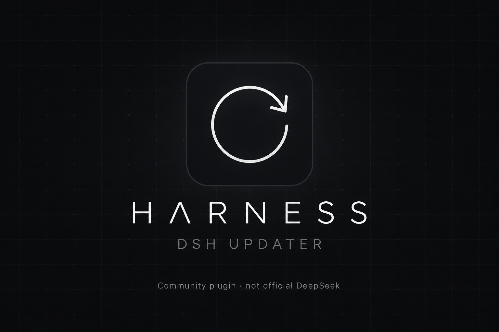
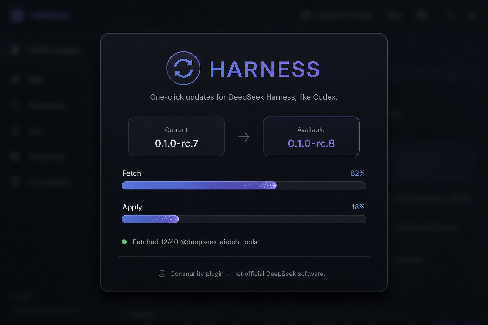
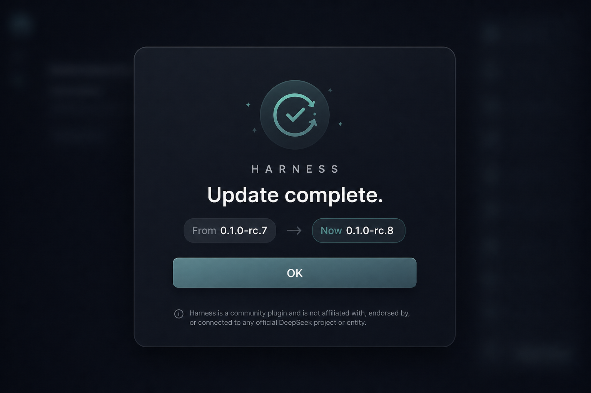

<p align="center">
  
</p>

<h1 align="center">dsh-updater</h1>

<p align="center">
  <strong>Mises à jour DeepSeek Harness (DSH) en un clic</strong><br>
  Plugin communautaire · tarballs npm incrémentaux · backup &amp; rollback · comme Codex
</p>

<p align="center">
  <a href="README.md">English</a>
</p>



**dsh-updater** ajoute **Réglages → Updates** et un bouton dans la barre latérale de [DeepSeek Harness](https://github.com/deepseek-ai/deepseek-harness). Il lit les dist-tags npm `next` / `latest`, copie le moteur actuel, télécharge **seulement les paquets qui ont changé**, remplace le moteur en cours, puis redémarre — ou te demande de quitter DSH sur une machine nu.

**Pas un logiciel officiel DeepSeek.** Pas de fork, pas de `git pull` du source, pas de `sudo`, pas de `curl | bash`.

Un `npm install @deepseek-ai/dsh` complet reconstruit ~200 paquets en RAM et peut OOM. Ici : copie du moteur, tarballs du delta, rollback auto.

## Installation

Jamais `dsh plugin add github:…` (non piné) :

```bash
git clone https://github.com/Takinggg/dsh-updater.git
dsh plugin --profile web add /chemin/absolu/vers/dsh-updater
```

## Captures

| Téléchargement | Succès |
| --- | --- |
|  |  |

## Licence

[MIT](LICENSE) — plugin communautaire, pas un produit DeepSeek.
